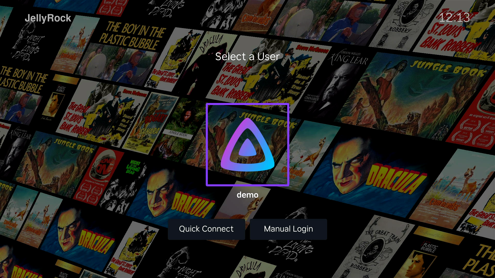
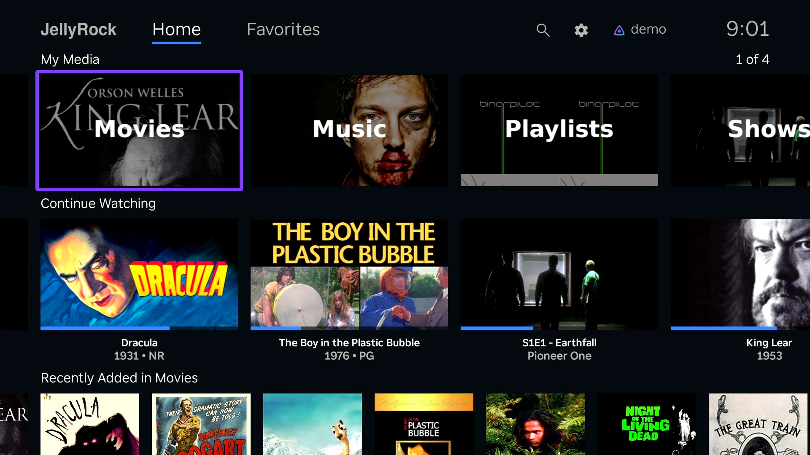

<!-- markdownlint-disable MD041 -->
[](https://channelstore.roku.com/details/232f9e82db11ce628e3fe7e01382a330:a85d6e9e520567806e8dae1c0cabadd5/jellyrock)

[](https://github.com/jellyrock/jellyrock/releases)
[](https://github.com/jellyrock/jellyrock/actions/workflows/build.yml?query=branch%3Amain)
[](https://jellyrock.github.io/api-docs/)
[](LICENSE)
<!-- [](https://translate.jellyfin.org/projects/jellyfin/jellyfin-roku/?utm_source=widget) -->

JellyRock is a Jellyfin client for Roku devices with a focus on stability and UX. Originally forked from jellyfin-roku [v2.2.5](https://github.com/jellyfin-archive/jellyfin-roku-legacy/releases/tag/v2.2.5).

## Changelog

All notable changes to this project are documented in [CHANGELOG.md](CHANGELOG.md).

## Prerequisites

- Roku OS 11 or later
- Jellyfin server 10.7.0 or later

## Install

### Using your Roku device

- Navigate to Home -> Search -> "JellyRock".

### Using your browser

- Visit the [Roku Channel Store](https://channelstore.roku.com/details/232f9e82db11ce628e3fe7e01382a330:a85d6e9e520567806e8dae1c0cabadd5/jellyrock) -> Add app -> Login. This will install JellyRock on **all** devices linked to your Roku account.

## Screenshots

  <a href="docs/screenshots/userSelect.png" target="_blank" title="User Select">
    
  </a>
  <a href="docs/screenshots/home.png" target="_blank" title="Home">
    
  </a>
  <a href="docs/screenshots/libraryGrid.png" target="_blank" title="Library grid">
    
  </a>
  <a href="docs/screenshots/movieDetails.png" target="_blank" title="Movie Details">
    
  </a>
  <a href="docs/screenshots/osd.png" target="_blank" title="On-Screen Display(OSD)">
    
  </a>
  <a href="docs/screenshots/trickplay.png" target="_blank" title="Trickplay">
    
  </a>

## Sideload / Beta Test

To run the latest version of JellyRock before it hits the Roku Channel Store:

1. Put your Roku device in [Developer Mode](docs/dev/developer-mode.md). Save your password!
2. Download the latest [build](https://github.com/jellyrock/jellyrock/actions/workflows/build.yml?query=branch%3Amain) created by GitHub Actions. Select the first item listed then click one of the links at the bottom of the page i.e. `JellyRock-prod-main-e34f4f169ff47531abd23ae3a11c102f6811f907`. This will download a zip file to your computer.
3. Put your Roku's IP from step 1 into a browser i.e. `http://192.168.1.2` and press enter.
4. Log in with credentials from step 1.
5. Upload and install the zip file downloaded in step 2.

> NOTE: The app will always be at the bottom of your Roku's channel list and it will *not* automatically update.

## Build

```bash
git clone https://github.com/jellyrock/jellyrock.git
cd jellyrock
npm install
# Note: If npm scripts are disabled, manually run `npm run ropm` to install dependencies
npm run build # OR npm run build:prod
```

## User Docs

- [App Settings](docs/user/app-settings.md)
- [Jellyfin Server Feature Matrix](docs/user/jellyfin-server-feature-matrix.md)

## Dev Docs

- [Developer Mode](docs/dev/developer-mode.md)
- [Dev Guide](docs/dev/DEVGUIDE.md)
- [Logging](docs/dev/logging.md)
- [New User Setting](docs/dev/new-user-setting.md)
- [Registry Migrations](docs/dev/registry-migrations.md)
- [SDK API Versioning](docs/dev/sdk-api-versioning.md)
- [TDD Workflow](docs/dev/unit-tests-tdd.md)
- [Unit Tests](docs/dev/unit-tests.md)
