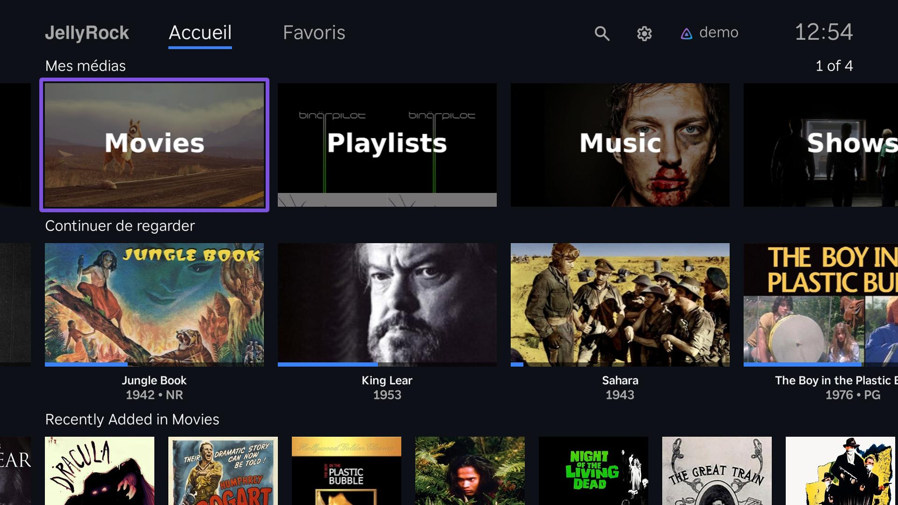
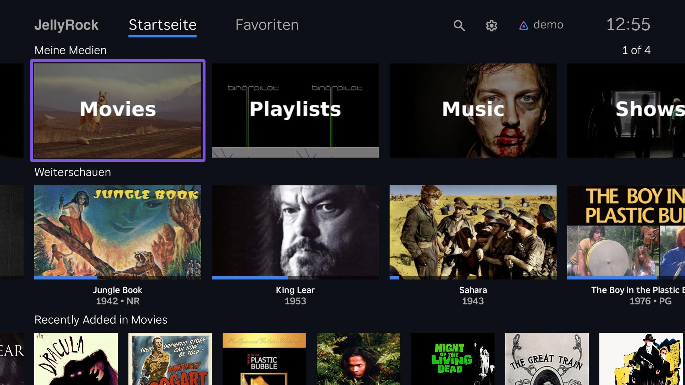
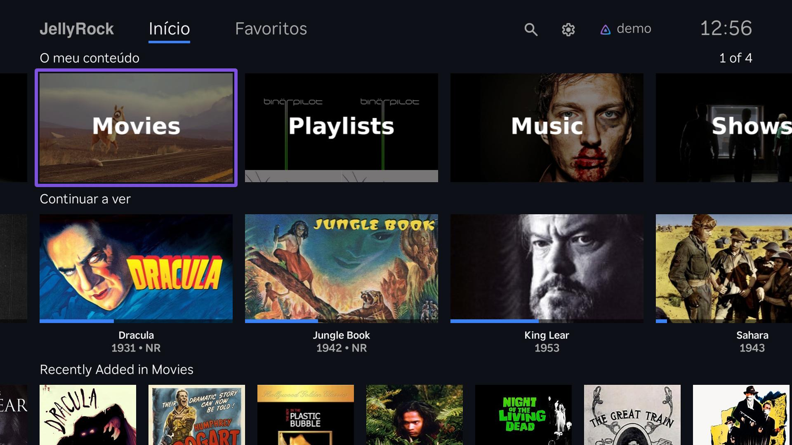

<!-- markdownlint-disable -->
<!--
  THIS FILE IS AUTO-GENERATED by scripts/screenshots-index.js. DO NOT EDIT BY HAND.
  Regenerated by `npm run screenshots:index` and every `npm run screenshots:capture`.
  To change which languages appear, edit tests/rta/config.js (languages / storeLanguages).
-->

# JellyRock screenshots by language

> 🤖 Auto-generated — do not edit by hand. Pick a language to view its screenshot set (User Select, Home, Library Grid, Movie Details, OSD, Trickplay).

## Store languages

[English (US)](en_US/) · [Français](fr/) · [Deutsch](de/) · [Português](pt/) · [Español](es/)
